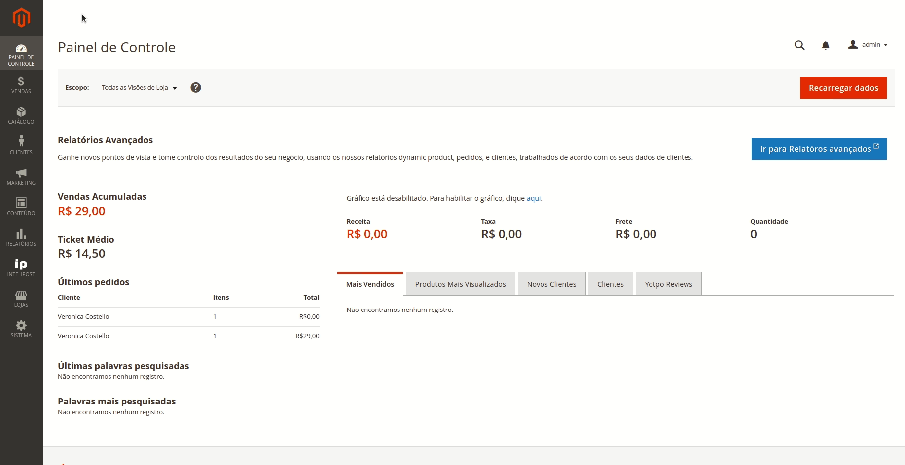
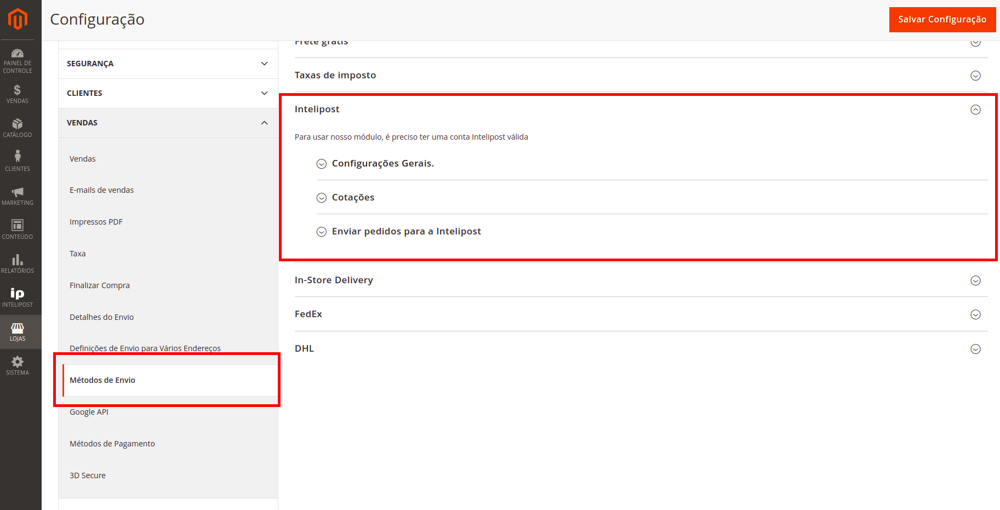
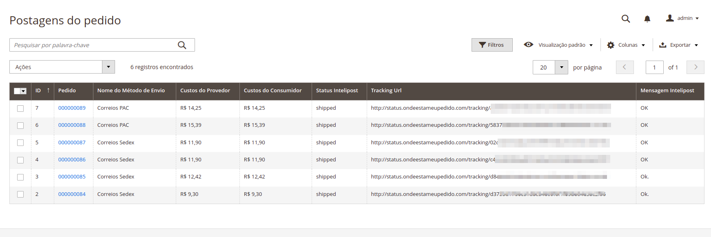
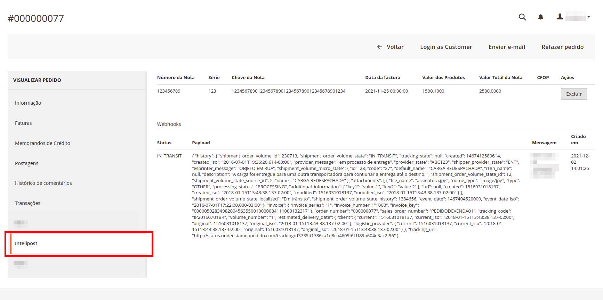
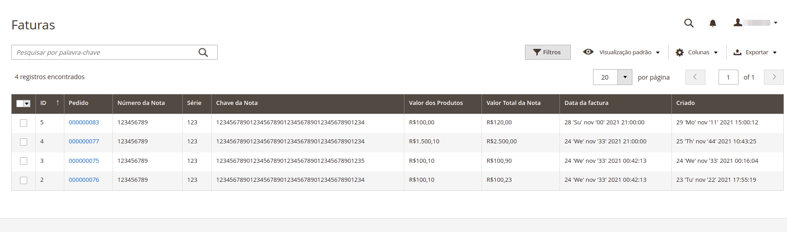
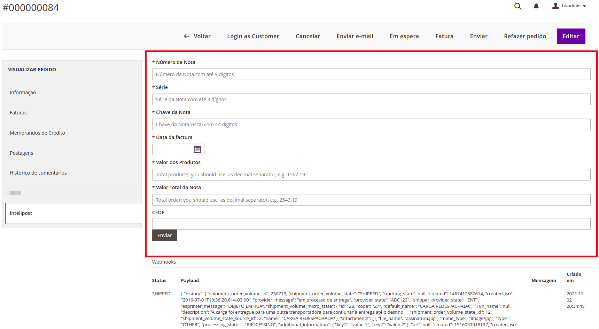
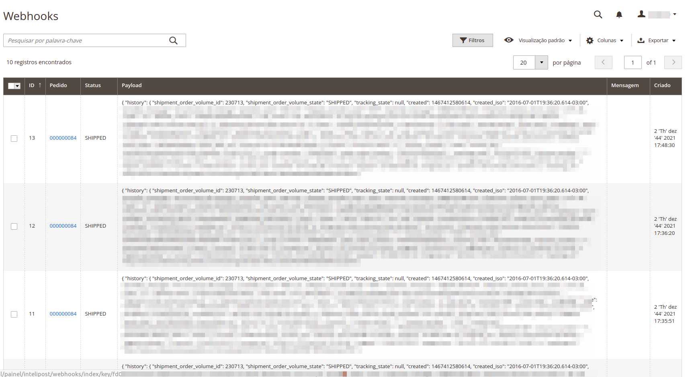
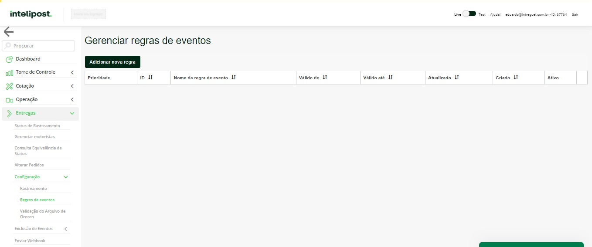
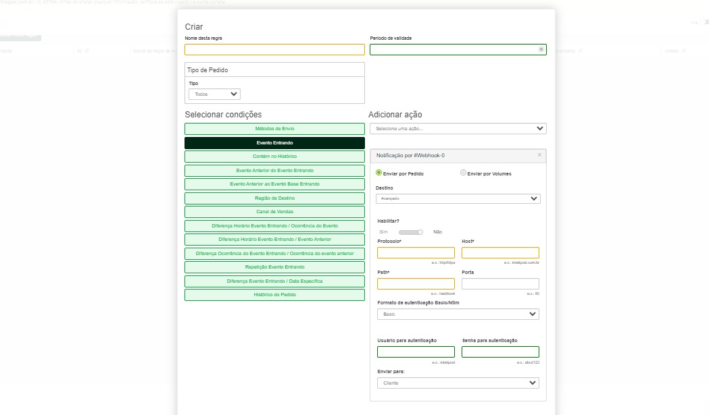

# Intelipost - Adobe Commerce


#Instalação
Para a utilização desses módulos, é recomendável remover os módulos antigos da cotação da Intelipost.
```
composer remove intelipost/magento2-push
composer remove intelipost/magento2-quote
composer remove intelipost/magento2-tracking
```

Após remover os módulos antigos, só instalar o módulo novo (em breve estará no packagist)
```
composer config repositories.intelipost-shipping git https://github.com/intelipost/Magento2.git
composer require intelipost/magento2:dev-master
php bin/magento setup:static-content:deploy pt_BR
php bin/magento setup:upgrade
php bin/magento setup:di:compile
```


**Instalação Manual**

Download o arquivo e coloque na pasta
```
app/code/Intelipost/Shipping
```

Depois rodar os comandos de instalação

```
php bin/magento setup:upgrade
php bin/magento setup:di:compile
php bin/magento setup:static-content:deploy pt_BR en_US
```

## Descrição
Módulo disponível em português e inglês, compatível com a versão 2.3+ do Adobe Commerce.  
O módulo utiliza a API da Intelipost para a cotação de frete e envio de pedidos para a Intelipost

## Menu


## Configurações

#### Cotação de Frete baseado nas regras cadastradas na Intelipost  

  

Nas configurações da loja, pode-se determinar como o módulo deve funcionar, dentre eles:
- Chaves de Configuração   
- Se irá usar Centro de Distribuição Cadastrado na Loja como Origem  
- Código enviar no sales_channel para identificação dentro da Intelipost  
- Campo de CPF no cadastro do cliente  
- Adicionar Cálculo de Frete na Página de Produto  
- Adicionar dias à cotação  
- Unidade de Medida utilizada  
- Quais atributos serão utilizados para dimensões  
- Enviar pedidos para a Intelipost  
- Habilitar webhook para recebimento de atualizações de status de pedidos  
- Alteração de status para as etapas do envio  

## Postagens do Pedido  

  

- Nesse link, é possível ver todas as postagens dos pedidos, com link para o pedido, e as URL dos pedidos
- Através dessa tela, é possível criar e enviar pedidos para Intelipost através do menu de Ações
- Dentro de cada pedido tem uma nova aba também para que você possa ver os status desses pedidos

  

## Faturas

  

- Nesse link, é possível ver todas as faturas enviadas dos pedidos, que serão enviadas para a Intelipost
- As faturas podem ser enviadas via admin, na página do pedido, ou via API  
  
*Página de Pedido*  


*VIA API*  
Para criação da invoice no Magento via API é ncessário que seja obtido o token na plataforma Magento relativo a conta do cliente. 
Para fazer isso é possivel utilizar um Token de Admin da plataforma Magento.  

Após a obteção do token do Magento na requisição anterior, a inclusão da invoice deverá ser executada conforme a requisição a seguir:

Method: POST  
URL: `{URL_LOJA}/intelipost/invoices` => o campo URL_LOJA é a URL da loja Magento do cliente  
header 'Authorization: Bearer TOKEN_API' => o campo TOKEN_API deverá ser substituído pelo token retornado na requisição anterior.  
header 'Content-Type: application/json'  
Body:
```
{
    "invoice": [
        {
            "number": ,
            "order_increment_id": "",
            "series": "",
            "key": "",
            "date": "",
            "total_value": "",
            "products_value": "",
            "cfop": "",
            "invoice_protocol": "",
            "invoice_type": ""
        }
    ]
}
```
Descrição dos Campos do Body da requisição:
- number: é o número da nota fiscal e seu type é number
- order_increment_id: é o número do pedido e seu type é string
- series: é o número de série da nota fiscal e seu type é string
- key: é o número da chave da DANFE e seu type é string
- date: é a data de emissão da nota fiscal e seu type é date no seguinte formato AAAA-MM-DDTHH:MM:SS
- total_value: é o valor total da nota fiscal e seu type é string no seguinte formato 00.00, com duas casas decimais separadas por ponto
- products_value: é o valor total dos produtos da nota fiscal e seu type é string no seguinte formato 00.00, com duas casas decimais separadas por ponto
- cfop: é o código da operação fiscal utilizado na emissão da nota fiscal e seu type é string
- invoice_protocol: é o número do protocolo de autorização da NFe (nProt) e seu type é string
- invoice_type: é o tipo da nota fiscal (tpNF) e seu type é string (ENTRADA ou SAIDA)


*Exemplos*

- "POST" - /V1/intelipost/invoices (Criar nova Invoice)
- "BODY"
```
"{
  "invoice": [
    {
      "number": 0,
      "order_increment_id": "string",
      "series": "string",
      "key": "string",
      "date": "string",
      "total_value": "string",
      "products_value": "string",
      "cfop": "string",
      "invoice_protocol": "string",
      "invoice_type": "string"
    }
  ]
}"
```

- "GET" - /V1/intelipost/invoices (Listar Invoices)

```
curl --location -g --request GET 'URL_LOJA/rest/V1/intelipost/invoices?searchCriteria[filterGroups][0][filters][0][field]=order_increment_id&searchCriteria[filterGroups][0][filters][0][value]=000000001&searchCriteria[filterGroups][0][filters][0][conditionType]=eq' \
--header 'Authorization: Bearer TOKEN_API'
```

- "GET" - /V1/intelipost/invoices/:id (Uma única Invoice)

## NFe Import API

O módulo agora suporta importação de NFe (Nota Fiscal Eletrônica) via API. As seguintes endpoints estão disponíveis:

### Importar NFe Individual

- "POST" - /V1/intelipost/nfe/import
- Importa uma única NFe XML
- Body:
```json
{
  "xmlContent": "base64_encoded_xml_content",
  "orderIncrementId": "000000001" // opcional
}
```

### Importar Múltiplas NFes

- "POST" - /V1/intelipost/nfe/import-multiple
- Importa múltiplas NFes de uma vez
- Body:
```json
{
  "items": [
    {
      "xmlContent": "base64_encoded_xml_content",
      "orderIncrementId": "000000001" // opcional
    },
    {
      "xmlContent": "base64_encoded_xml_content",
      "orderIncrementId": "000000002" // opcional
    }
  ]
}
```

### Validar NFe XML

- "POST" - /V1/intelipost/nfe/validate
- Valida se o XML da NFe está correto sem importar
- Body:
```json
{
  "xmlContent": "base64_encoded_xml_content"
}
```

**Observações:**
- O conteúdo XML deve ser enviado em formato base64
- Se o orderIncrementId não for fornecido, o sistema tentará extraí-lo do XML
- As NFes importadas são automaticamente enviadas para a API da Intelipost se houver um envio associado ao pedido


## Labels
- "GET" - /V1/intelipost/labels (Listar Etiquetas)
```
curl --location -g --request GET 'URL_LOJA/rest/V1/intelipost/labels?searchCriteria[filterGroups][0][filters][0][field]=order_increment_id&searchCriteria[filterGroups][0][filters][0][value]=000000001&searchCriteria[filterGroups][0][filters][0][conditionType]=eq' \
--header 'Authorization: Bearer TOKEN_API'
```
- "GET" - /V1/intelipost/labels/:id


## Comandos Console

O módulo fornece comandos de console para executar manualmente as tarefas agendadas (cron jobs):

### Limpar Cotações Antigas
```bash
php bin/magento intelipost:quotes:clear
```
Remove cotações antigas do banco de dados conforme configurado no sistema.

### Processar Pedidos Prontos para Envio
```bash
php bin/magento intelipost:order:ready-for-shipment
```
Processa pedidos que estão prontos para serem enviados para a Intelipost.

### Enviar Pedidos
```bash
php bin/magento intelipost:order:ship
```
Envia pedidos para processamento na Intelipost.

### Criar Pedidos
```bash
php bin/magento intelipost:order:create
```
Cria novos pedidos na Intelipost baseado nos pedidos do Magento.

**Observação:** Estes comandos executam as mesmas tarefas que os cron jobs configurados no módulo, permitindo execução manual quando necessário.


## Webhooks



- Nesse link, é possível ver todas as notificações via webhook recebidas
- Lembrando que é preciso cadastrar os webhooks dentro da Intelipost em Entregas -> Configuração -> Regras de evento -> Adicionar nova regra.

  


#### A URL deve ser:  
_https://URL_LOJA/intelipost/webhook_  
*Autenticação Basic*  
Usuário da Autenticação será sua chave de API  
Senha de autenticação podera ser preenchida com 123, apenas para não ficar vazia.  
